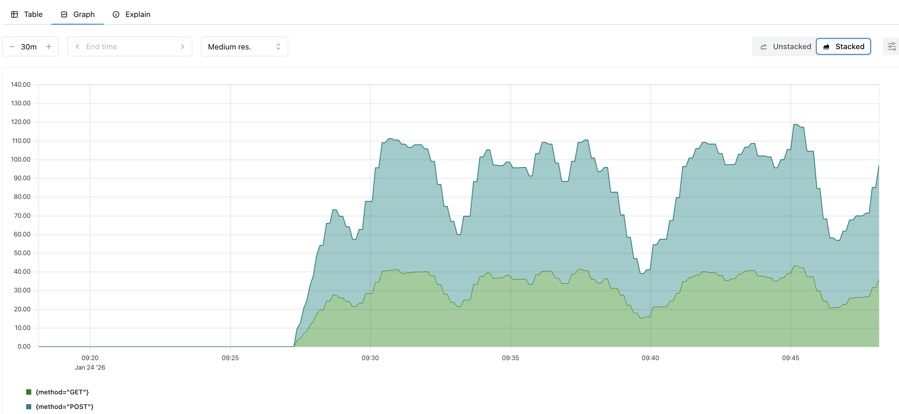
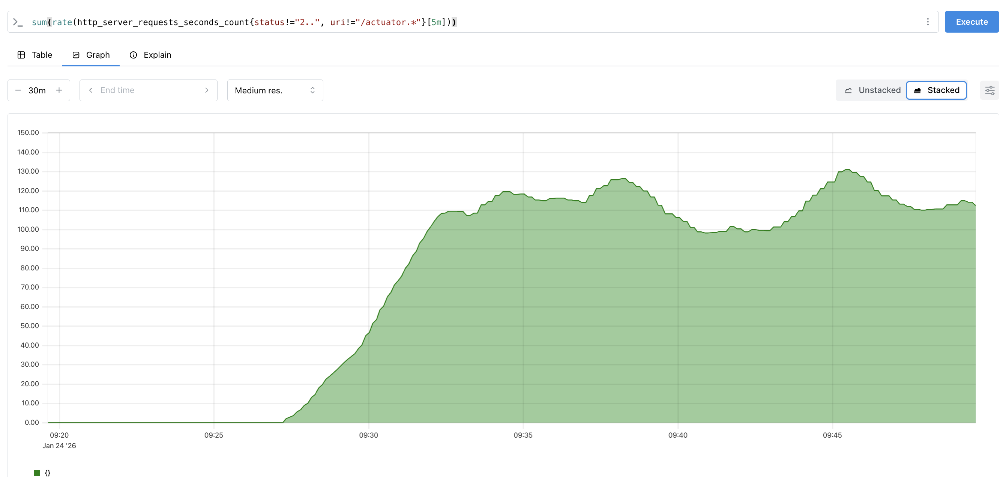
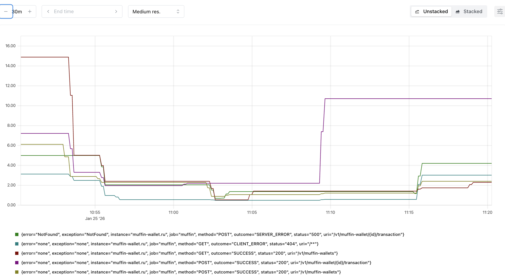
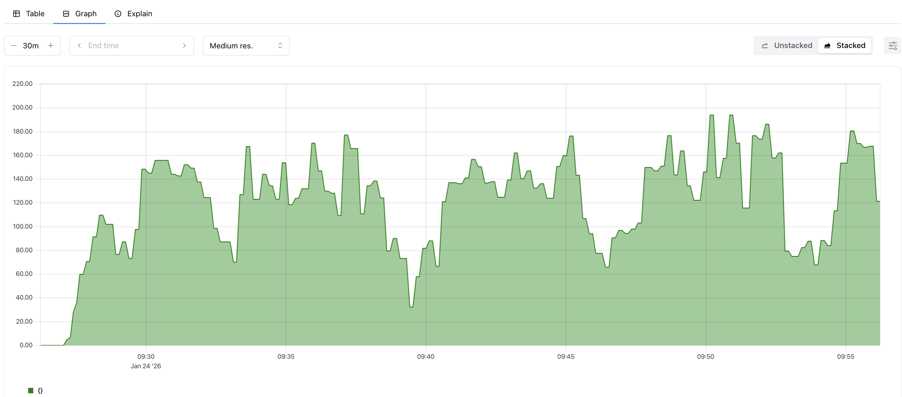

# Muffin wallet

## Database structure


## Sequence Diagram


## Запуск

Приложение развёрнуто с использованием istio. Ниже приведены шаги для корректного запуска.

1. Запустить minikube с помощью команды
   ```
   minikube start
   ```
2. Запустить tunnel в minikube
   ```
   minikube tunnel
   ```
3. Запустить образы базы данных и prometheus. Файл docker-compose находится в директории local-env
   ```
    docker compose up -d
   ```
4. Создать namespace muffin. Приложение будет располагаться в данном namespace.
   ```
    kubectl create namespace muffin
   ```
5. Скачать istio в кластер и установить side-car mode следующими командами.
   ```
    istioctl install --set profile=demo
    kubectl label namespace muffin istio-injection=enabled
   ```
6. Запустить helmfile, располагающийся в директории helm
   ```
   helmfile apply -f ./
   ```
7. Дождаться полного развёртывания подов. Можно наблюдать через команду
   ```
   kubectl get pods -n muffin -w
   ```
8. Если настроены хосты, то приложение можно открыть по muffin-wallet.ru.

9. В local_env выполнить команды:
   ```
   python3 -m venv venv
   source venv/bin/activate
   ```
   Мы работаем с Python virtual environment
   Должно поменяться местоположение в консоли на (venv) ...
10. Установить пакет для работы с запросами:
    ```
    pip install requests
    ```
11. Проверить, какой выбран компилятор запуска python (нужно выбрать pyvenv.cfg в папке venv)

12. Запустить скрипт командой:
    ```
    python ./load.py
    ```
    После этого в консоли будет текст подобного рода: Load test started at 2026-01-23 17:51:55.074863
13. Выход из ven:
    ```
    deactivate
    ```

После этого можно изучать нагрузку, открыв prometheus по localhost:9090

## Запросы

1. Количество запросов в секунду по каждому методу REST API вашего приложения.

   ```
   sum by (method) (
     rate(http_server_requests_seconds_count{
   uri=~"/v1/muffin-wallet.*"}[1m])
   )
   ```


График корректен, потому что:

- используется \*\_count => счётчик запросов
- rate() => переводит счётчик в RPS
- агрегация sum by (method) => показывает распределение по методам

График демонстрирует распределение входящего HTTP-трафика по методам REST API. Видно, что основную нагрузку создают POST-запросы (создание кошельков и транзакции), в то время как GET-запросы используются для чтения данных.

2. Количество ошибок в логах приложения.
   ```
   sum(rate(http_server_requests_seconds_count{status!="2..", uri!~"/actuator.*"}[5m]))
   ```
   
   График корректен, потому что:

- ошибки считаются через HTTP-статусы
- используется rate => интенсивность ошибок, а не общее число

3. 99-й персентиль времени ответа HTTP (обработка запросов).

   ```
   quantile_over_time(
   0.99,
   http_server_requests_seconds_max{uri!~"/actuator.*"}[10m]
   )
   ```

   
   Для оценки 99-го персентиля времени обработки HTTP-запросов используется функция quantile_over_time, применённая к метрике максимального времени ответа. Это позволяет определить значение задержки, ниже которого укладывается 99% наблюдений за заданный временной интервал, и оценить пиковые задержки при нагрузке.
   Наибольшие значения зафиксированы для операций транзакций, что объясняется их повышенной сложностью и использованием базы данных. Полученные результаты подтверждают ожидаемое поведение системы под нагрузкой.

4. Количество активных соединений к базе данных PostgreSQL.

   ```
   sum(rate(hikaricp_connections_usage_seconds_count[30s]))
   ```

   
   График корректен, потому что:
   - отражает реальное использование пула соединений
   - коррелирует с RPS из первого графика

   График демонстрирует количество активных соединений с базой данных PostgreSQL. При увеличении нагрузки наблюдается рост числа используемых соединений, что подтверждает корректную работу пула соединений HikariCP и его адаптацию к текущему уровню запросов.

## Логи и трейсы

Для корректности необходимо проделать аналогичные шаги, что были описаны в главе выше запуск

Часть сервисов была использована в docker compose в учебных целях, в реальных проектах они были бы перенесены в кластер.

Были собраны новые образы обоих приложений и обновлены values у соответствующих helm-чартов.

Также был обновлён ряд файлов в чартах для работы promtail и связи приложения с новыми сервисами.

Итоговый Dashboard имеет такой вид на настоящих данных.


По изображению делаем вывод, что отображение корректно фильтруется по ID трейса и уровню лога.

Приложен [json файл](/doc/dashboard.json) данного дашбоарда.

При тестировании необходимо в datasource добавить Loki и Zipkin
